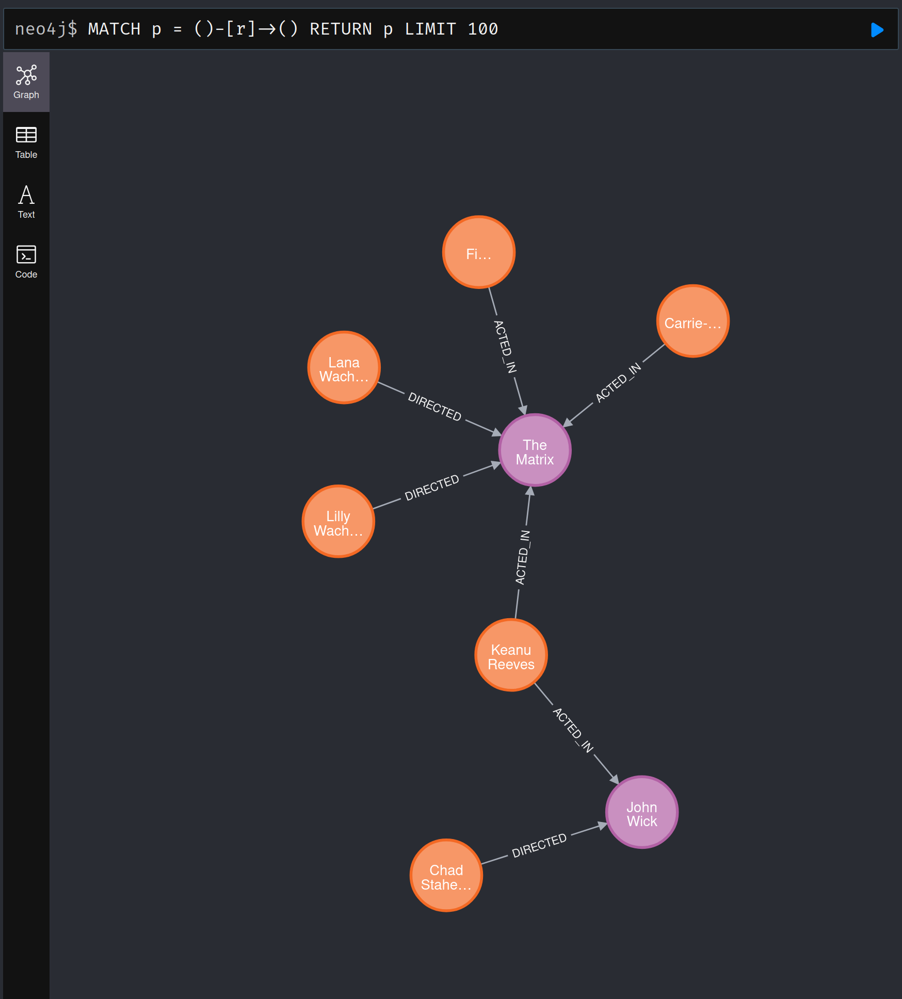

## Overview

This is a template repo allowing you to setup Neo4j alongside your assignment in `docker-compose`.
Modify the `main.py` file to answer each question in the assigment. This repo contains a working example
of the simplified _movies_ example from [Neo4j](https://neo4j.com/docs/getting-started/data-modeling/tutorial-data-modeling/). The topology is shown below:





Folder structure for graph assignment(s) is:

```text
assignment-repo/
├── docker-compose.yml   # The master file that orchestrates everything
├── app/                 # A folder for the student's application
│   ├── Dockerfile         # Instructions to build the student's app container
│   ├── main.py            # The student's Python script with the queries
│   ├── requirements.txt   # Python libraries needed (e.g., neo4j)
│── import/
│   └── movies.csv         # The data to be loaded
└── run.sh                 # The simple script for the marker to run
└── README.md  
```


### Getting Started

Check-out this repo and confirm that you can use docker-compose and docker by running this command:

```bash
docker-compose up --build --force-recreate
```

You should expect to see:

```
app_1    | --- Loading Movie Data ---
app_1    | ✅ Data loaded.
app_1    |
app_1    | --- Question 1: Who acted in 'The Matrix'? ---
app_1    | - Laurence Fishburne
app_1    | - Carrie-Anne Moss
app_1    | - Keanu Reeves
app_1    |
app_1    | --- Question 2: What movies has Keanu Reeves acted in? ---
app_1    | - John Wick
app_1    | - The Matrix
app_1    |
app_1    | --- Question 3: Who are Keanu Reeves' co-stars? ---
app_1    | - Laurence Fishburne (in The Matrix)
app_1    | - Carrie-Anne Moss (in The Matrix)
```
